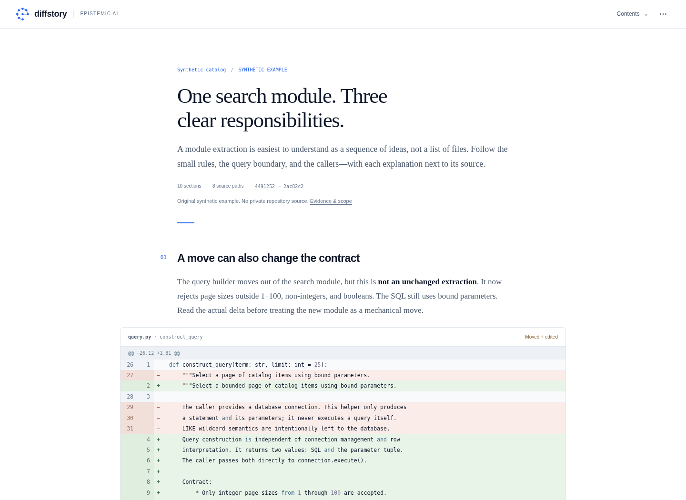

<p></p>

# Diffstory

**Read the change, not just the diff.**

A local-first literate code-review reader by [Epistemic AI](https://www.epistemic.ai). Diffstory turns committed code changes into one continuous document: **prose → source → prose → source**. Moved definitions appear together; large blocks expand where you are reading.

[Explore the demo](examples/demo.html) · [Architecture](docs/ARCHITECTURE.md) · [Contributing](CONTRIBUTING.md) · [Security](SECURITY.md)



## Try it

Download or clone this repository and open **`examples/demo.html`** in a browser. Download the HTML first; GitHub's file view does not execute it. No server, account, API key, web fonts, CDN, or internet connection is needed to read it. The example is original synthetic code, not an excerpt from a private repository.

To analyze your own checkout, use Python 3.10+ and Git:

```bash
python -m diffstory git \
  --repo /path/to/your/project \
  --base main --head HEAD \
  --out walkthrough.html
```

Or install the CLI from this source checkout:

```bash
python -m pip install .
diffstory --version
```

No third-party runtime dependencies. Build and browser-test tools are development-only dependencies.

## A reading path, not a dashboard

The reader alternates an explanation with the exact code that supports it, preserving original line numbers. **View diff** and **Read definition** switch one block in place. Long code starts with an excerpt; **Load full diff** and **Read full definition** progressively reveal the rest, at most 160 display rows per expansion. Code scrolls with the document, not inside a second vertical viewport.

**Contents** searches sections and symbols without filtering the document away. **Invariants, tests & notes** opens review details beneath a section. Notes and reviewed markers can be exported and imported with an exact base/head revision lock. Browser storage is best effort; export important notes.

“Lazy loading” means deferred rendering from embedded data. The complete supplied snapshot is still inside the HTML. Treat reports, snapshots, and exported evidence as source-code-bearing files.

## GitHub pull requests

```bash
diffstory github 'OWNER/REPO#NUMBER' \
  --out walkthrough.html \
  --save-snapshot walkthrough.snapshot.json
```

Replace `OWNER/REPO#NUMBER` with a real PR. Public PRs can be read without credentials, subject to GitHub rate limits. For private repositories, set `GITHUB_TOKEN` through your existing credential manager; `--token-env NAME` selects another environment variable. Do not paste tokens into issues, commits, commands saved to a shared history, or reports.

The CLI performs read-only requests, paginates changed files, pins both revisions, and rejects a PR that changes during retrieval. It does not inherit credentials from a chat application. The local Git comparison defaults to **merge-base(base, head) → head**; use `--two-dot` for an endpoint comparison. Uncommitted and untracked work is not included.

Every compilation writes standalone HTML plus an adjacent `.report.json`. Binary, oversized, unsupported, or missing source is explicitly reported; it is not silently treated as a complete analysis.

## What the compiler knows

Python functions, async functions, classes, and assignments are compared using the standard-library AST. Pairing distinguishes identical ASTs, declaration renames, edited move candidates, ordinary edits, additions, removals, and unresolved counterparts. Literals, internal names, defaults, decorators, and string whitespace are not erased to obtain a convenient match.

Static calls, references, import aliases, and test references form a dependency graph. Strongly connected components handle cycles; deterministic priorities produce a reproducible reading order. This is a comprehension heuristic, not a proof of an optimal order.

Other languages, newer Python syntax unsupported by your interpreter, and unclassified module-level code remain available as textual hunks. Classes are atomic units. Dynamic dispatch, reflection, unchanged external callers, and whole-program behavior are not fully resolved.

**Identical ASTs are not a proof of identical behavior. Test references are not measured coverage or passing tests.** Diffstory does not execute repository source, run its tests, or issue a merge-safety verdict.

## Add better prose without surrendering the evidence

The CLI creates deterministic baseline explanations. Domain-specific prose is a separate, revision-bound annotation layer. The bundled synthetic walkthrough includes authored annotations to demonstrate the intended reading experience.

```bash
diffstory evidence walkthrough.report.json --out narrative-evidence.json
# Write annotations.json from the documented evidence schema.
diffstory render walkthrough.report.json \
  --annotations annotations.json --out narrated.html
```

Evidence packets contain source code. Send them only to an approved model or environment. No model provider is called automatically, no API key is needed, and no billing integration is included. Annotation validation locks revisions and evidence IDs; it cannot establish that every prose claim is true. See [the annotation contract](docs/ARCHITECTURE.md#annotation-handoff).

## Develop and verify

```bash
python -m pip install -e '.[dev]'
python -m unittest discover -s tests -v
python examples/make_demo.py
python scripts/check_release.py
python -m playwright install chromium
python tests/browser_smoke.py
python -m build
python -m twine check dist/*
```

For a system Chromium installation, set `DIFFSTORY_CHROMIUM` to its executable path. Browser tests exercise rendering, navigation, expansion, notes, responsive layout, and offline behavior. They do not claim tests passed in the analyzed repository. See [verification](docs/VERIFICATION.md) for the checks actually run on this release.

## Public examples and privacy

Only original synthetic source belongs in public fixtures. Generated review files are ignored by default, with explicit exceptions for `examples/demo.*`. `scripts/check_release.py` checks the public file set for known private-fixture identifiers and common credential patterns before publishing. It is a defense-in-depth check, not a comprehensive secret detector.

The analyzer is read-only and the reader does not contact external services. Explicitly clicked source links open GitHub. The release helper in `scripts/publish.sh` is a separate, opt-in GitHub write operation; it is never called by the analyzer.

## Status and license

**0.3.0 · alpha.** Usable for local review and experimentation; not a substitute for tests or human review. Automatic model narration, whole-repository indexing, statement-level extraction matching, and verified test-artifact ingestion remain future work.

Software and original synthetic examples: [MIT](LICENSE). Epistemic AI trademarks and the supplied logo have separate terms in [NOTICE](NOTICE) and [Branding](docs/BRANDING.md). No font files are bundled.
